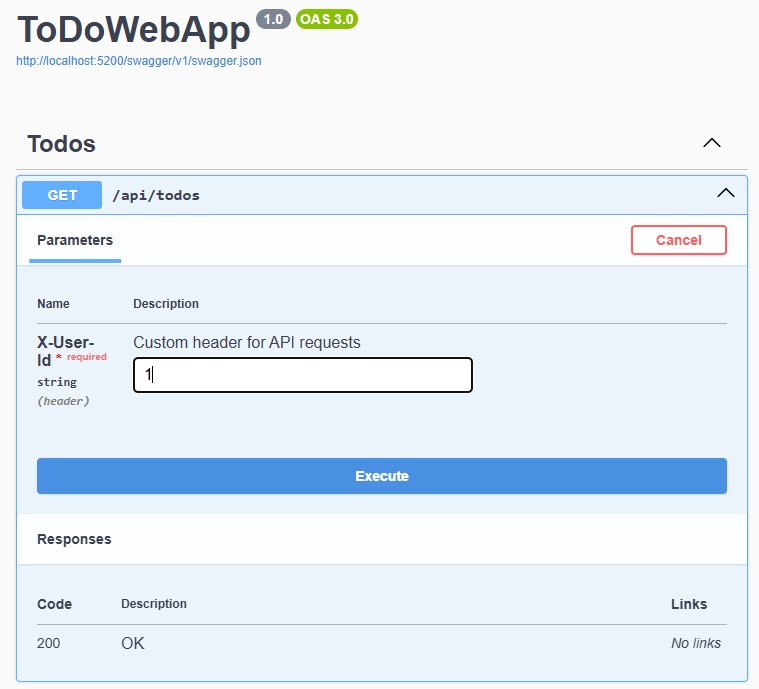

# To Do Web App

## Requirements
- The user must be able to see their TODO list, add items to it and delete items from it
- Use the latest version of angular for the frontend
- Use the latest version of .NET web API for the backend
- You can manage the data on the backend in memory, no need to set up a database for this test
- Follow best practices around code, testing and architecture as you understand them
- Email us your solution in the form of a link to a git repository
- If any special instructions are needed to run the project, beyond npm install and restoring nuget packages, put them in a readme in the repository

## Backend

The backend is an ASP.NET Core - minimal Web Api - that uses an In Memory database with Entity Framework.

Pre-requistes:

.NET 8.0 inatalled

Visual Studio 2022 

The Web Api can be run directly from Visual Studio and hosts Swagger which can be used to test the endpoints independently of the front-end.

### User Context
To make the backend functionality a bit mnore 'real-world', 3 users are seeded in the database when the application starts up. These are hard coded and the User Id's are used to create a fake authentication check and associates to dos with the selected user.

In the ToDoDbContext class this method seeds the database;

```
  protected override void OnModelCreating(ModelBuilder modelBuilder)
  {
      modelBuilder.Entity<ToDoModel>()
          .HasIndex(t => new { t.UserId, t.Deleted });

      modelBuilder.Entity<UserModel>().HasData(
          new UserModel { Id = 1, Name = "Alice Vance" },
          new UserModel { Id = 2, Name = "Bob Smith" },
          new UserModel { Id = 3, Name = "Charlie Johnson" }
      );
  }

```

One of these User Id's must be included in a custom header for each request to get through the middleware check in Program.cs

```
  // 1. Check if the header is missing or completely un-parseable (Client Error = 400)
  if (!context.Request.Headers.TryGetValue("X-User-Id", out var userIdStr) ||
      !int.TryParse(userIdStr, out var userId))
  {
      context.Response.StatusCode = StatusCodes.Status400BadRequest;
      await context.Response.WriteAsync("Bad Request: The 'X-User-Id' header is missing or must be an integer.");
      return;
  }


```

In Swagger this the X-User-Id header is required - just make sure you use an existing user id value - 1, 2 or 3.



The front end app uses a drop down list with the mathcing user id's and injects the 'X-User-Id' header into each request.

```
private getHeaders(): HttpHeaders {
    return new HttpHeaders({
      'X-User-Id': this.userService.currentUser()?.toString() || ''
    });
}

```


### Approach
I've used a 'features' folder approach to co-locate related pieces of code. Some dependency injection has been introduced for the services - typically I would also abstract away the DbContext but for a project of this size that is not needed.

There is quite a lot of middleware plumbing in Program - this is to handle CORS and the custom header X-User-Id which acts as a fake authentication token if it matches an existing user in the database.

https://learn.microsoft.com/en-us/aspnet/core/tutorials/min-web-api?view=aspnetcore-8.0&tabs=visual-studio

https://learn.microsoft.com/en-us/training/modules/build-web-api-minimal-database/

https://learn.microsoft.com/en-us/aspnet/core/fundamentals/middleware/?view=aspnetcore-10.0

### Testing
There are two test types - the ToDoWebApp.Endpoints.IntegrationTests spin up an instance of the Web Api and interact with at at the Http request level. This provides a good end to end, integration test and validates the behavior that a client app can expect.

The ToDoWebApp.Service.Tests is focused on testing the ToDoService in isolation - it introdruces some mocking of the validators but ideally the DbContext would be behind an interface and the ToDoService functionality tested in pure isolation, 

## Frontend

This is an angular app and was developed with Visual Studio Code 

Run the following commands to run the application.

```
npm install
```

```
ng serve
```

### Approach
This is created with the ```ng new <app-name>``` command and then refactored to meet the To Do app requirments. This involved going through an Angular To Do App tutorial and then copying and changing the code manually.

https://kurtwanger40.medium.com/building-a-production-ready-todo-app-in-angular-with-signals-and-localstorage-40c009360cee

https://medium.com/@anjnkmr/from-zero-to-hero-learn-angular-by-building-a-todo-app-debd41c6f2a6

https://nx.dev/docs/technologies/angular/guides/using-tailwind-css-with-angular-projects

https://angular.dev/tutorials/first-app

### Testing
Have relied on manual testing so far with the frontend - to some extend leaning on a well defined and tested backend. Given more time I would extend the existing default tests generated by the  


